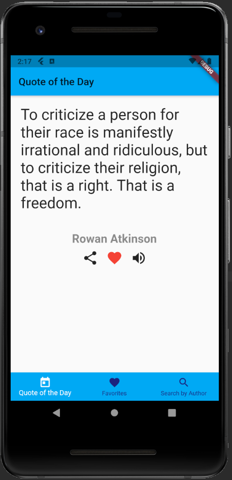
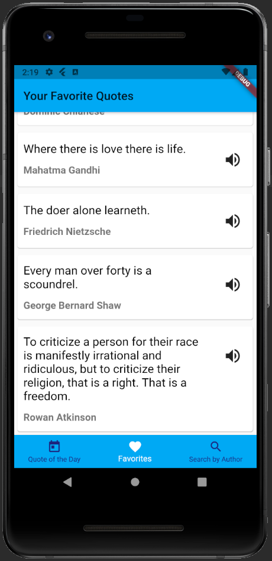
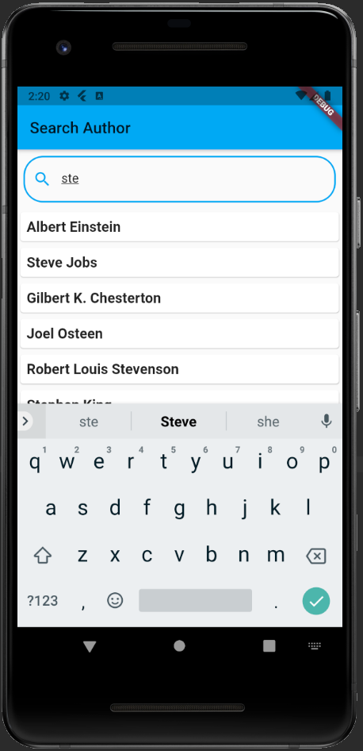
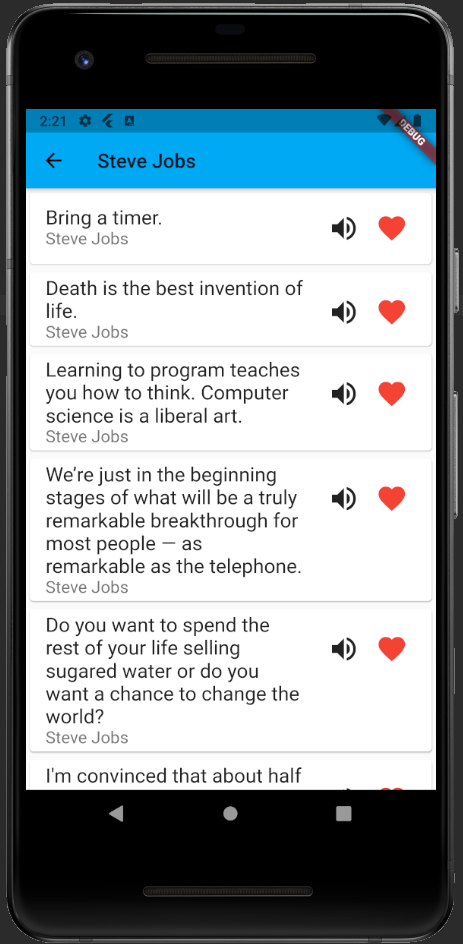

# MyQuotes

> Flutter, Dart, SQLite, AWS (Amazon Polly), FavQs API v2 (https://favqs.com/api)

The mobile application displays quotes from an external API, after pressing the speaker button are converted into speech using the service **Amazon Polly** from Amazon Web Services.

#### Quote of the day screen

Each time we enter this screen a new random quote is displayed. The user can:  
* add a quote to your favorites
* share a quote

### Favorites quotes screen

### Delete favorite quote

### Search quote by author

### Author's quotes

